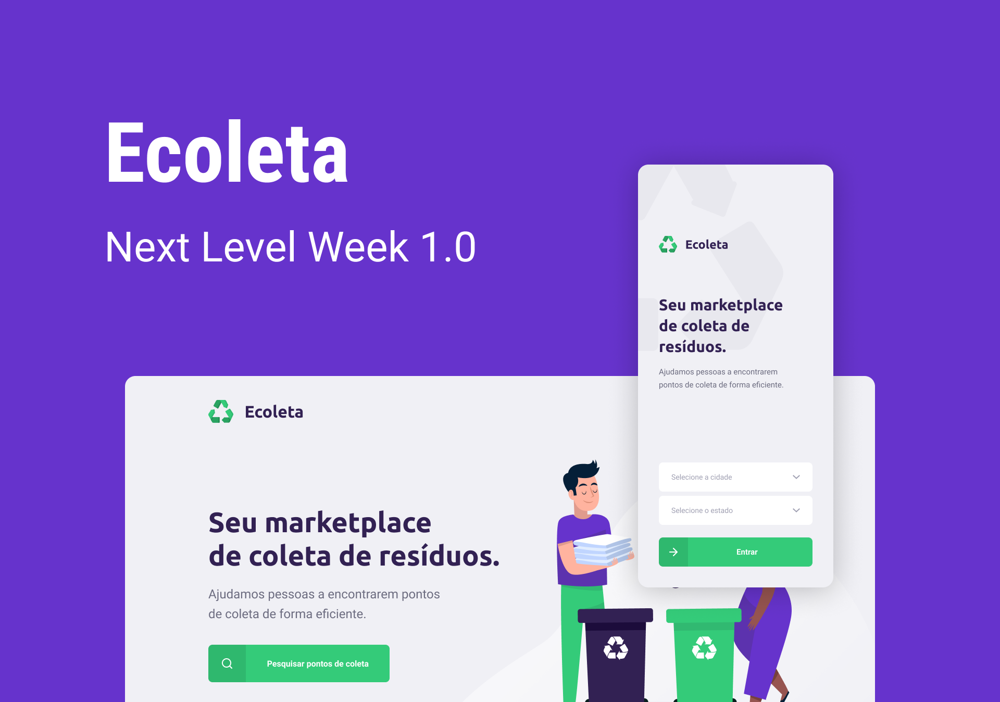

# Next Level Week Starter
## Projeto desenvolvido pela [rocketseat](https://rocketseat.com.br/) para ensinar programação do nível básico a o avançado.

## Release History
* 1.0.0
    * (~07/06/2020)

## Meta

Diego Lopes Ferreira – [@Twitter](https://twitter.com/Diego_simSouEu) – [@Instagram](https://www.instagram.com/diego.lopes.f/) - [LinkedIn](https://www.linkedin.com/in/diego-lopes-ferreira-a23a8919b/) - [Coders Rank](https://profile.codersrank.io/user/diego-lopes-ferreira)

Distributed under the MIT license. See [License](LICENSE) for more information.

